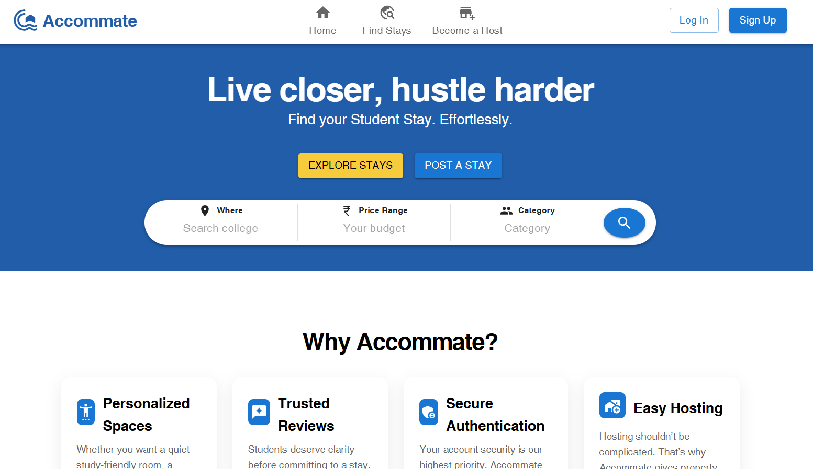
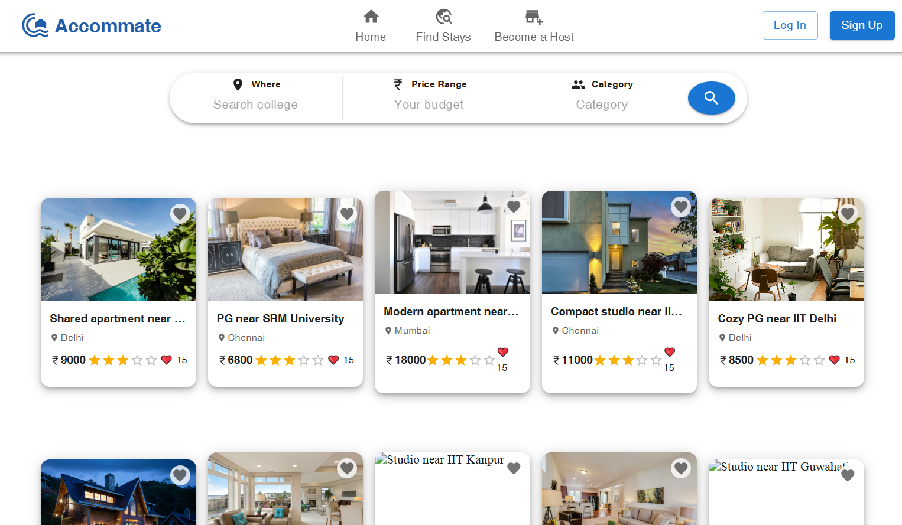

<div align="center">
# [Accommate 🔗](https://accommate.onrender.com/Accommate)
**Accommate** is a student accommodation platform built with the main goal of helping students easily find stays near their college or campus.

<h1>Accommate</h1>
<h3>Production-Grade Full-Stack Application <br> MERN • Docker • Cloud Deployment </h3>
Live Demo: [ <a href="https://accommate.vercel.app/">https://accommate.vercel.app/</a> ]
<p></p>

</div>

---

## Demo

**Accommate** Website link: [ https://accommate.vercel.app ]

<p align="center">
  
  
</p>

---

<details>
<summary>🛠️Tech Stack</summary>
    
- **Frontend :** React.js, MUI
- **Backend :**
    - Node.js
    - Express.js
    - RESTful API
    - MVC Architecture

- **Database :** MongoDB (MongoDB Atlas)
- **Infrastructure & Deployment :**
    - Docker
    - DockerHub
    - Vercel (Frontend Hosting)
    - Render (Backend Hosting)
    - AWS EC2

- **Authentication & Security :**
    - Passport.js
    - Express Session
    - Cookie-based Authentication
    - CORS Configuration
- **Media Storage :** Cloudinary

---
</details>

<details>
<summary>🛒Features Accommate Provide</summary>
    
- 🔐 User Authentication & Authorization for personalized experience
- 🏘️ Connects students directly with housing owners
- ⭐ Flexible ratings and reviews system
- ⚡ Smooth and modern browsing experience

---

</details>

<details>
<summary>💹 Application Evolution Phases</summary>
    
- Phase1: 1.x.x
    - EJS+Bootstrap(UI) + CRUD
    - Auth(express sessions & Passport.js)
    - Client & Serverside Data Validation
    - Multer+Cloudinary Image storage
    - MongoDB Atlas ➜ Database
    - Render ➜ Deployment
- Phase2: 2.x.x
    - React.js + MUI(UI) ➜ **EJS Migration**
    - Vercel(frontend) + Render(backend) ➜ Deployment
- Phase3: 3.x.x
    - Dockerize application (multi-stage builds)
    - dev and prod separate containerization
- Phase4: 4.x.x
    - CICD
        - Component testing
        - Unit testing
    - AWS EC2 ➜ Deployment

</details>

---

<details>
<summary>⚙️ Local Setup Instructions</summary>

### 1. Clone the repository 
```
git clone https://github.com/your-username/Accommate.git
cd Accommate
```

### 2. Setup Environment variables
- create `.env` file inside `/server`
- Add following credentials insed .env file:
    - ATLASDB_URL=mongodb://localhost:27017/your-db
    - SESSION_SECRET=yoursecret

### 3. Setup backend (server)
```
cd server
npm ci #install dependencies
npm run dev #run dev server
```
Backend runs on http://localhost:8080

### 4. Setup Frontend (client)
```
cd client
npm ci
npm run dev
```
Frontend runs on http://localhost:5173

---

</details>

<details>
<summary>🐋 Docker Container Setup</summary>
    
### 1. Clone the repository 
```
git clone https://github.com/your-username/Accommate.git
cd Accommate
```

### 2. Setup Environment Variables
Create a `.env` file in the root directory:

MONGODB_URI=mongodb://mongodb:27017/your-db

### 3. Start Containers
```
docker-compose up --build
```
- Hot reload enabled
- Services run on:
    - Frontend: http://localhost:5173  
    - Backend: http://localhost:8080

---

</details>

<details>
<summary>🐳 Docker Production Image</summary>

Production images are built using **multi-stage** Docker builds and pushed via CI/CD.

Pull latest image:
```
docker pull shreelaxmihegde/accommate-frontend:latest
docker pull shreelaxmihegde/accommate-backend:latest
```

</details>

---

_This project is open source and available under the <b>MIT License</b>._

> This project acts as a **sandbox** where I experiment with techniques and conventions typically used in **real-world** applications.
